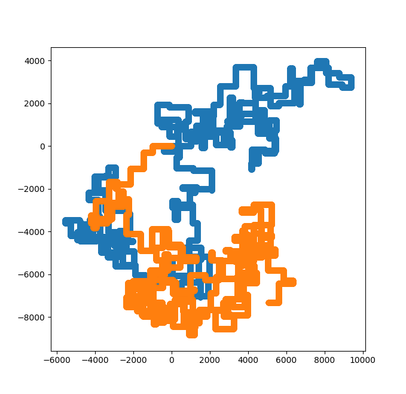

README:

Day 1: -fuelReq = floor(x / 3) - 2
       -calc fuelReq recursively

Day 2: Instuctions with +,* and terminate

Day 3: Wire crossings. Shortest Manhattan distance and shortest combined distance to intersections
